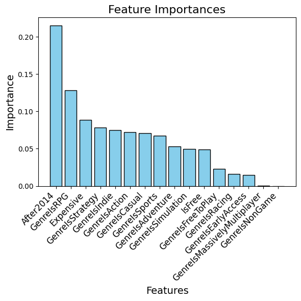
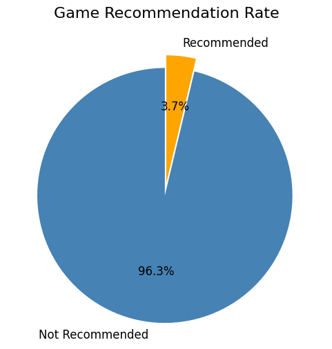

<link rel="stylesheet" href="styles.css">

## Steam User Preference and Game Recommendation using Simple Decision Tree Classifier

Lingxi Liu

Department of EPSS

Fall 2024 AOS C204 Final Project

## Introduction 

Steam is the biggest gaming platform, hosting over 50,000 video games and over 132 million users globally [1]. Each user can "recommend" or "not recommend" a game by simply clicking a button while reviewing a game. Using game features such as genres and release dates, we can classify a user's reviewed games and find out the user's gaming preference.

The datasets I'm using are [Steam Games](https://www.kaggle.com/datasets/thedevastator/get-your-game-on-metacritic-recommendations-and) dataset provided by The Devastator and [Game Recommendations on Steam](https://www.kaggle.com/datasets/antonkozyriev/game-recommendations-on-steam) dataset provided by Anton Kozyriev, both on [Kaggle](https://www.kaggle.com/datasets). Steam Games includes game features, and Game Recommendations describes user reviews.

I used the scikit-learn decision tree classifier to train and test the model on multiple users. I found that this model only works well for certain users with very clear game preferences (liking the same type of games); if a user plays a variety of different games and likes all of them, the model isn't useful in recommending them new games or analyzing their preference. For some users who only give out positive or negative views, the model has a very high accuracy but is meaningless in recommending games.


## Data

#### FEATURES
The [Steam Games](https://www.kaggle.com/datasets/thedevastator/get-your-game-on-metacritic-recommendations-and) dataset contains one CSV file named "games-features-edit.csv" with over 12,000 games, mostly released before January 2017. This data is collected from Steam API and is under the Steam API term of use. The clean-up process of this file can be found in [this script](assets/game_feature_data.ipynb). The example pandas data column is shown below:


| ResponseName              |   ReleaseDate |   Metacritic |   RecommendationCount | IsFree   | GenreIsNonGame   | GenreIsIndie   | GenreIsAction   | GenreIsAdventure   | GenreIsCasual   | GenreIsStrategy   | GenreIsRPG   | GenreIsSimulation   | GenreIsEarlyAccess   | GenreIsFreeToPlay   | GenreIsSports   | GenreIsRacing   | GenreIsMassivelyMultiplayer   |   PriceInitial |   After2014 |   Expensive |
|--------------------------|--------------|-------------|----------------------|---------|-----------------|---------------|----------------|-------------------|----------------|------------------|-------------|--------------------|---------------------|--------------------|----------------|----------------|------------------------------|---------------|------------|------------|
| Counter-Strike            |          2000 |           88 |                 68991 | False    | False            | False          | True            | False              | False           | False             | False        | False               | False                | False               | False           | False           | False                         |           9.99 |           0 |           0 |
| Team Fortress Classic     |          1999 |            0 |                  2439 | False    | False            | False          | True            | False              | False           | False             | False        | False               | False                | False               | False           | False           | False                         |           4.99 |           0 |           0 |
| Day of Defeat             |          2003 |           79 |                  2319 | False    | False            | False          | True            | False              | False           | False             | False        | False               | False                | False               | False           | False           | False                         |           4.99 |           0 |           0 |
| Deathmatch Classic        |          2001 |            0 |                   888 | False    | False            | False          | True            | False              | False           | False             | False        | False               | False                | False               | False           | False           | False                         |           4.99 |           0 |           0 |
| Half-Life: Opposing Force |          1999 |            0 |                  2934 | False    | False            | False          | True            | False              | False           | False             | False        | False               | False                | False               | False           | False           | False                         |           4.99 |           0 |           0 |


First I cleaned out the games not released, and then I added a release-date feature by extracting the release year using Python's re module since the release-date column is not in uniform date form. Lastly, I filtered out the games that had no recommendation reviews and reduced the data length to 4846, almost 1/3 of the original. I added the "Expensive" feature to the dataset based on the price of the game, if it's sold at more than 20 dollars then I classified it as expensive, thus will have a "True" value for this feature. The cleaned-up data is exported to [this file](assets/game_feature_data.csv), later used to be combined with the target file.

#### TARGET
The [Game Recommendations on Steam](https://www.kaggle.com/datasets/antonkozyriev/game-recommendations-on-steam) dataset contains two files, "recommendations.csv" with over 41 million Steam game reviews and "games.csv" with all the game names, release dates, and IDs. The clean-up and compile process can be found in [this script](assets/recommendation.ipynb). The example pandas data column of the merged product is shown below:

|   app_id |   helpful |   funny | date       | is_recommended   |   hours |          user_id |   review_id | date_release        | title                             |   year |
|----------|-----------|---------|------------|------------------|---------|------------------|-------------|---------------------|-----------------------------------|--------|
|    13500 |         0 |       0 | 2021-03-29 | True             |     0.1 | 748899           | 1.42596e+07 | 2008-11-21 00:00:00 | Prince of Persia: Warrior Within™ |   2008 |
|    13500 |         7 |       2 | 2018-12-29 | True             |   168.3 |      1.1283e+07  | 1.42807e+07 | 2008-11-21 00:00:00 | Prince of Persia: Warrior Within™ |   2008 |
|    13500 |         8 |       3 | 2021-11-12 | True             |     1.2 |      1.15536e+07 | 1.4281e+07  | 2008-11-21 00:00:00 | Prince of Persia: Warrior Within™ |   2008 |
|    13500 |         3 |       0 | 2020-09-28 | False            |     1.2 |      1.2823e+07  | 1.42925e+07 | 2008-11-21 00:00:00 | Prince of Persia: Warrior Within™ |   2008 |
|    13500 |         0 |       0 | 2013-08-25 | True             |    17.3 |      1.1681e+07  | 3.00331e+07 | 2008-11-21 00:00:00 | Prince of Persia: Warrior Within™ |   2008 |

Each user has a unique user ID, and this ID can be repeated many times (a user even reviewed more than 6000 games, so their reviews would take up 6000 rows in this dataset) for each game that they review. Similarly, the game ID repeats many times as different users review them. First, the two CSV files are merged together by game_id to fetch the game name and release date for later processing. Then, users who viewed more than 1000 games are selected from the original massive dataset, acting as our potential training target so that the model has enough data to be trained. Lastly, games released after 2016 are filtered out to match the features data. When this dataset is ready, the target data is merged with features data by game title, and luckily both dataset has almost identical game name formats. For decision tree processing, all "True/False" values are turned into "1/0". The final product is exported to [this file](assets/data_cleaned.csv), to be imported to the model script for analysis. The list of users is also obtained through the value_count() method for the pandas dataframe, exported to [this file](assets/list_of_users.csv).

## Modelling

First, an individual user is selected. There are 56 users who reviewed more than 1000 games total, and 53 of them reviewed more than 100 games released before 2017. Users are randomly selected for each run, and the user id can be modified at the top of [this file](assets/decisiontree.ipynb) that contains the model script.

Once the user ID is obtained, a separate dataframe can be created like so:

```python
# import dataset to work with
df = pd.read_csv('data_cleaned.csv')

# extract specific user
luckyguy = df[df['user_id'] == user_id]
```

There are many machine learning tools that are suitable for recommendation systems, such as SVD (single value decomposer)[2] or CF (collaborative filtering)[3]. SVD would be the ideal method for creating an actual recommendation system for every user in the 41 million-long datasets since it compares the recommendations from users who play similar games to provide a reliable prediction of games that anyone may like. However, SVD requires the data in a uniform matrix (for example, if there are 500 games to analyze, then each user will need to have 500 entries; if they never reviewed that game, then the entry value would be zero), and to process our massive amount of data to this shape requires more work that can be done in the limited time, with limited memories on my laptop. Due to the variety of the games needed for this analysis, I want as many games as possible in my training dataset; therefore I need to cut the number of users to make this model work. Cutting the number of users can result in not enough comparable users, thus the best method for this project would be to use a simple decision tree classifier on an individual user. The model script can be found in [this file](assets/decisiontree.ipynb).

```python
from sklearn.tree import DecisionTreeClassifier
from sklearn.model_selection import train_test_split
from sklearn.metrics import accuracy_score, classification_report, mean_squared_error
# select features and target
feature_columns = [
    'IsFree', 
    'GenreIsNonGame', 
    'GenreIsIndie', 
    'GenreIsAction', 
    'GenreIsAdventure', 
    'GenreIsCasual', 
    'GenreIsStrategy', 
    'GenreIsRPG', 
    'GenreIsSimulation', 
    'GenreIsEarlyAccess', 
    'GenreIsFreeToPlay', 
    'GenreIsSports', 
    'GenreIsRacing', 
    'GenreIsMassivelyMultiplayer', 
    'After2014', 
    'Expensive'
]
X = luckyguy[feature_columns]
y = luckyguy['is_recommended']

# split the dataset into train and test
X_train, X_test, y_train, y_test = train_test_split(X, y, test_size=0.2, random_state=20)

# train 
model = DecisionTreeClassifier(random_state=42)
model.fit(X_train, y_train)

# predictions
y_pred = model.predict(X_test)

# evaluate model's performance
accuracy = accuracy_score(y_test, y_pred)
print(f"Accuracy: {accuracy:.2f}")

# classification report
print("\nClassification Report:\n")
print(classification_report(y_test, y_pred))

# calculate RMSE
mse = mean_squared_error(y_test, y_pred)
rmse = np.sqrt(mse)

print(f"Mean Squared Error (MSE): {mse:.2f}")
print(f"Root Mean Squared Error (RMSE): {rmse:.2f}")
```

Note that there are random factors included in the model, each run will likely produce a slightly different model accuracy. For result visualization, I used the code from HW3 to plot the feature importance in the decision tree.

```python3
import matplotlib.pyplot as plt

# calculate feature importances for each feature from HW3
importances = model.feature_importances_

std = np.std([tree.feature_importances_ for tree in model.estimators_], axis=0) if hasattr(model, 'estimators_') else None
indices = np.argsort(importances)[::-1]

# plot
plt.figure(figsize=(6,6))
plt.title("Feature Importances", fontsize=16)
plt.bar(range(len(feature_columns)), importances[indices], color="skyblue",
        yerr=std[indices] if std is not None else None, align="center", edgecolor="black")
plt.xticks(range(len(feature_columns)), np.array(feature_columns)[indices], rotation=45, ha='right', fontsize=12)
plt.xlabel("Features", fontsize=14)
plt.ylabel("Importance", fontsize=14)
plt.tight_layout()
plt.show()

# print feature ranking
print("Feature Ranking:")
for rank, index in enumerate(indices, start=1):
    print(f"{rank}. {feature_columns[index]} ({importances[index]:.4f})")
```

To examine the user's recommendation preference, I also made a pie chart to show the recommendation percentage.

```python3
# count recommendation for this user
recommendation_counts = luckyguy['is_recommended'].value_counts()
labels = ['Not Recommended', 'Recommended']
values = recommendation_counts.values
colors = ["steelblue", "orange"]

# Pie Chart for Recommendation Rate
plt.figure(figsize=(10, 6))
plt.pie(
    values, 
    labels=labels, 
    colors=colors, 
    autopct='%1.1f%%', 
    startangle=90, 
    textprops={'fontsize': 12},
    explode=(0.1, 0)  # slightly explode the "Recommended" slice
)
plt.title("Game Recommendation Rate", fontsize=16)
plt.show()
```

## Results

The model is applied to ~10 users. Here, I will show an example output from the user who gave the most recommendations. This user (ID = 11656130) reviewed 3624 games.

Model accuracy and RMSE report:
Accuracy: 0.96
Mean Squared Error (MSE): 0.04
Root Mean Squared Error (RMSE): 0.20



*Figure 1: Feature Importance for this user.*



*Figure 2:Recommendation Rate for this user.*

The model accuracy for this user is very high with a very small error. The results infer two reasons for a well-working model: 
1. this user gives reviews to only a certain type of games as shown in feature importance (we have a few features that are distinctly more important than others)
2. this user almost only gives a "not recommended" review to the games they play. Therefore, even without the model, randomly guessing the user will give a "not recommended" to a new game will have a ~96% accuracy by pure possibilities.

The accuracy of the model varies for different users due to the reasons specified above. 
For user ID = 11250992, the variety of games and recommendation rate are both higher than the example user and model accuracy drops to 0.62;
For user ID = 574944, the variety of games and recommendation rate are even higher than above, and model accuracy drops to 0.54.

It seems like the user ID is a unique identification value given for this dataset, as I tried finding my own Steam ID, but I didn't find a match. 

## Discussion

Due to the limitations of the model and the dataset, there are some drawbacks.

The dataset that contains the features only has relatively old games; if a Steam user is used to newer or higher graphic quality games that are released more recently, they might give older games "not recommended" just because of the difference in game graphic quality. And if that is the case, our model will not be as useful for predicting if they will like a newer game, since our training data will be majority of "not recommended". This limits our model's use of games released within the timeframe of the dataset.

Steam allows game library sharing, meaning that multiple people can share the same user account to play games purchased on only one account. If these people all have different tastes in games, the same user account can appear to give out very different reviews on games, lowering our model accuracy.

Even video games within the same genre can be very different depending on their stories, art styles, difficulty levels, music, etc. There are many descriptive "tags" that can also be used as features in our model on top of genres, however, the cleaned-up data I used doesn't have them, and it is extremely difficult to pull them from a massive raw JSON file on a personal computer. Due to the difficulty of this task, I did not include any "tags" as features, but in any future projects, incorporating them will increase the model accuracy. 

## Conclusion

Here is a brief summary. From this work, the following conclusions can be made:
* first conclusion
* second conclusion

Here is how this work could be developed further in a future project.

## Special Thanks

The code writing for this project had help from [ChatGPT](https://chatgpt.com/).

Some other coding questions are answered by the previous course ICCs and StackOverflow.

## References
[1] [Steam Statistics (2024) —Active Users & Market Share](https://www.demandsage.com/steam-statistics/)

[2] [https://github.com/Michalos88/Game-Recommendation-System](https://github.com/Michalos88/Game-Recommendation-System)

[3] [The Steam Engine: A Recommendation System for Steam Users](https://brandonlin.com/steam.pdf)

[back](./)
